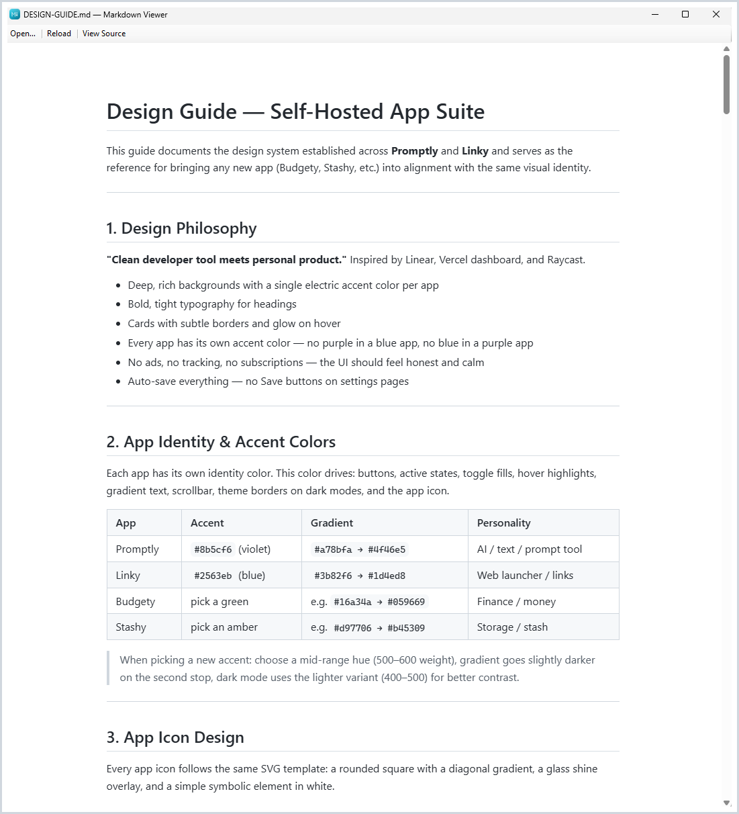

# Markdown Viewer


<kbd></kbd>

A lightweight Windows Markdown viewer built with .NET 8 and WebView2. Drag-and-drop or open any `.md` file to see a rendered preview, with live reload on file changes. Includes a View Source mode with syntax highlighting using VS Code Light+ colors and a line-number gutter.

## Features

- Rendered Markdown preview via WebView2
- Live reload when the file changes on disk
- View Source mode with syntax highlighting (VS Code Light+ colors)
- Line-number gutter in source view
- Drag-and-drop file support
- `.md` file association (optional, via installer)

## Requirements

- Windows 10 or later
- [.NET 8 Runtime](https://dotnet.microsoft.com/download/dotnet/8.0) (if running without the installer)
- WebView2 Runtime (included with Windows 11 and Edge)

## Installation

Download `MarkdownViewerSetup.exe` from the [latest release](https://github.com/larsmikki/markdown-viewer/releases/latest) and run it.

## Building from source

Requires [.NET 8 SDK](https://dotnet.microsoft.com/download/dotnet/8.0). Optionally [Inno Setup 6](https://jrsoftware.org/isinfo.php) to build the installer.

```
build.bat
```

The app is published to `dist\MarkdownViewer\` and the installer (if Inno Setup is found) to `dist\MarkdownViewerSetup.exe`.

## License

MIT — see [LICENSE](LICENSE).
